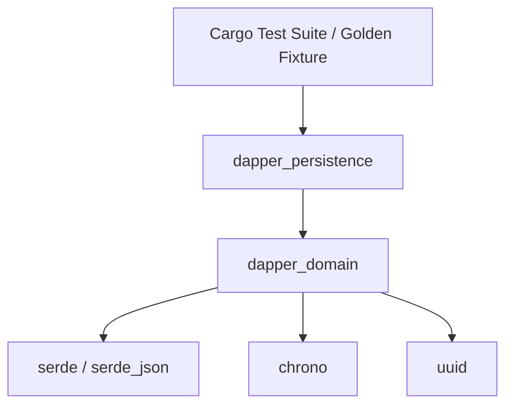

# Phase 1 Architectural Design Document: Rust Core Foundation

This document outlines the detailed architectural design and implementation plan for **Phase 1: Rust Core Foundation** (`crates/dapper_domain` and `crates/dapper_persistence`).

---

## 1. Objectives & Scope of Phase 1

1. **Cargo Workspace Initialization:** Set up the root `Cargo.toml` workspace and crate directory structure under `crates/`.
2. **`dapper_domain` Crate:** Implement pure Rust domain entities, state machine invariants, `shadow_hierarchy` git-like merge baseline, PI Planning capacity calculator, and role permission manager.
3. **`dapper_persistence` Crate:** Implement `JsonWorkspaceRepository` with `serde` / `serde_json` to load and save `.json` workspace files with 100% backward compatibility.
4. **Golden Test Suite Validation:** Validate Rust serialization/deserialization against the Phase 0 baseline fixture (`tests/fixtures/golden_workspace.json`) via `cargo test`.

---

## 2. Workspace Crate Layout & Dependencies



### Root `Cargo.toml` (`/Cargo.toml`)
```toml
[workspace]
resolver = "2"
members = [
    "crates/dapper_domain",
    "crates/dapper_persistence",
]

[workspace.dependencies]
serde = { version = "1.0", features = ["derive"] }
serde_json = "1.0"
thiserror = "2.0"
uuid = { version = "1.0", features = ["v4", "serde"] }
chrono = { version = "0.4", features = ["serde"] }
tokio = { version = "1.0", features = ["full"] }
tracing = "0.1"
anyhow = "1.0"
```

### `crates/dapper_domain/Cargo.toml`
```toml
[package]
name = "dapper_domain"
version = "0.1.0"
edition = "2021"

[dependencies]
serde = { workspace = true }
serde_json = { workspace = true }
thiserror = { workspace = true }
uuid = { workspace = true }
chrono = { workspace = true }
tracing = { workspace = true }
```

### `crates/dapper_persistence/Cargo.toml`
```toml
[package]
name = "dapper_persistence"
version = "0.1.0"
edition = "2021"

[dependencies]
dapper_domain = { path = "../dapper_domain" }
serde = { workspace = true }
serde_json = { workspace = true }
thiserror = { workspace = true }
tracing = { workspace = true }
```

---

## 3. Detailed Technical Specifications

### A. Domain Entities (`crates/dapper_domain/src/entities.rs`)

```rust
use serde::{Serialize, Deserialize};
use std::collections::HashMap;

#[derive(Debug, Clone, Serialize, Deserialize, PartialEq, Eq)]
pub enum Status {
    New,
    InDevelopment,
    InTesting,
    Blocked,
    Complete,
}

#[derive(Debug, Clone, Serialize, Deserialize, PartialEq)]
pub struct Team {
    pub name: String,
}

#[derive(Debug, Clone, Serialize, Deserialize, PartialEq)]
pub struct Story {
    pub id: String,
    pub title: String,
    pub description: String,
    pub team: Option<Team>,
    pub gitlab_id: Option<i64>,
    pub gitlab_iid: Option<i64>,
    pub weight: f64,
    pub status: Status,
    pub assignee_id: Option<i64>,
    pub iteration_id: Option<i64>,
    pub labels: Vec<String>,
    pub last_synced_at: Option<String>,
    pub is_conflicted: bool,
    pub parent_feature_id: Option<String>,
}

#[derive(Debug, Clone, Serialize, Deserialize, PartialEq)]
pub struct Feature {
    pub id: String,
    pub title: String,
    pub description: String,
    pub team: Option<Team>,
    pub gitlab_id: Option<i64>,
    pub gitlab_iid: Option<i64>,
    pub stories: Vec<Story>,
    pub last_synced_at: Option<String>,
    pub is_conflicted: bool,
    pub parent_epic_id: Option<String>,
}

#[derive(Debug, Clone, Serialize, Deserialize, PartialEq)]
pub struct Epic {
    pub id: String,
    pub title: String,
    pub description: String,
    pub gitlab_id: Option<i64>,
    pub gitlab_iid: Option<i64>,
    pub features: Vec<Feature>,
    pub last_synced_at: Option<String>,
    pub is_conflicted: bool,
}
```

### B. Workspace & Shadow Hierarchy Baseline (`crates/dapper_domain/src/workspace.rs`)

```rust
#[derive(Debug, Clone, Serialize, Deserialize, PartialEq)]
pub struct Workspace {
    pub active_product_name: Option<String>,
    pub products: Vec<Product>,
    pub epics: Vec<Epic>,
    pub members: HashMap<i64, Member>,
    pub labels: HashMap<String, Label>,
    pub iterations: Vec<Iteration>,
    pub hidden_iteration_ids: Vec<i64>,
    pub shadow_hierarchy: HashMap<String, serde_json::Value>,
    pub deleted_remote_items: Vec<serde_json::Value>,
    pub product_teams: HashMap<String, Vec<Team>>,
    pub member_capacities: HashMap<String, MemberCapacity>,
}

impl Workspace {
    pub fn save_shadow_hierarchy(&mut self) {
        self.shadow_hierarchy.clear();
        for epic in &self.epics {
            if let Ok(val) = serde_json::to_value(epic) {
                self.shadow_hierarchy.insert(epic.id.clone(), val);
            }
            for feature in &epic.features {
                if let Ok(val) = serde_json::to_value(feature) {
                    self.shadow_hierarchy.insert(feature.id.clone(), val);
                }
                for story in &feature.stories {
                    if let Ok(val) = serde_json::to_value(story) {
                        self.shadow_hierarchy.insert(story.id.clone(), val);
                    }
                }
            }
        }
    }
}
```

### C. Capacity Engine (`crates/dapper_domain/src/capacity.rs`)

```rust
pub struct CapacityCalculator;

impl CapacityCalculator {
    pub fn calculate_member_capacity(
        days_in_sprint: f64,
        pto_days: f64,
        allocation_pct: f64,
        velocity_factor: f64,
        utilization_factor: f64,
    ) -> f64 {
        let net_days = (days_in_sprint - pto_days).max(0.0);
        let alloc = (allocation_pct / 100.0).clamp(0.0, 1.0);
        let vel = (velocity_factor / 100.0).clamp(0.0, 1.0);
        let util = (utilization_factor / 100.0).clamp(0.0, 1.0);
        
        net_days * alloc * vel * util
    }
}
```

### D. JSON Workspace Repository (`crates/dapper_persistence/src/json_repository.rs`)

```rust
pub struct JsonWorkspaceRepository;

impl JsonWorkspaceRepository {
    pub fn load_from_file(path: &std::path::Path) -> Result<Workspace, PersistenceError> {
        let file = std::fs::File::open(path)?;
        let reader = std::io::BufReader::new(file);
        let workspace: Workspace = serde_json::from_reader(reader)?;
        Ok(workspace)
    }

    pub fn save_to_file(workspace: &Workspace, path: &std::path::Path) -> Result<(), PersistenceError> {
        let file = std::fs::File::create(path)?;
        let writer = std::io::BufWriter::new(file);
        serde_json::to_writer_pretty(writer, workspace)?;
        Ok(())
    }
}
```

---

## 4. User Review & Clarifying Points

> [!IMPORTANT]
> **Phase 1 Review Questions for Discussion:**
> 1. **Cargo Workspace Root:** Should the root `Cargo.toml` be placed directly in the main `DapperPlanning/` repository directory alongside `crates/`?
> 2. **JSON Backward Compatibility:** Does the proposed `serde` JSON schema for `Workspace` match all expected JSON keys (`active_product_name`, `products`, `epics`, `members`, `labels`, `iterations`, `shadow_hierarchy`, `deleted_remote_items`) from Phase 0?
> 3. **Validation Threshold:** Shall we enforce that `cargo test` runs against `tests/fixtures/golden_workspace.json` in Phase 1 integration tests?
