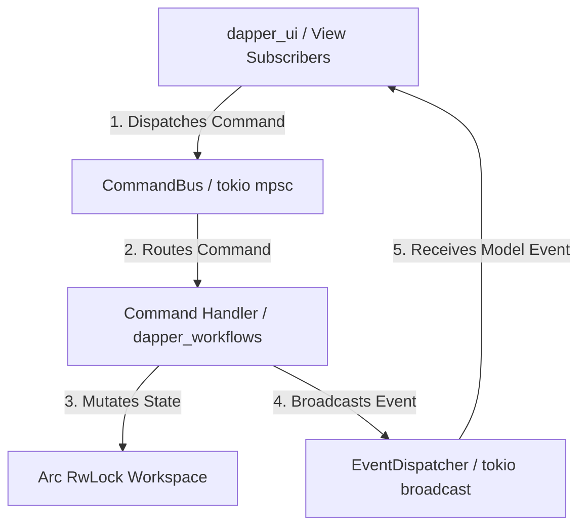

# Phase 2 Architectural Design Document: CQRS Architecture, Async Event Bus & App Context

This document details the architectural design and implementation specification for **Phase 2: CQRS Architecture, Async Event Bus, Command Bus & App Context** (`crates/dapper_core`).

---

## 1. Objectives & Scope of Phase 2

1. **`dapper_core` Crate Setup:** Initialize `crates/dapper_core` in the Cargo workspace manifest (`Cargo.toml`).
2. **Asynchronous Command Bus (`tokio::sync::mpsc`):** Implement a strongly-typed, bounded command channel router for state-mutating CQRS operations.
3. **Thread-Safe Event Dispatcher (`tokio::sync::broadcast`):** Implement a high-performance pub-sub event broker using `Arc<Event>` zero-copy broadcasting to decouple UI view subscribers from controllers.
4. **Application Context DI Container (`AppContext`):** Provide thread-safe shared workspace access (`Arc<tokio::sync::RwLock<Workspace>>`) and service injection.
5. **Observability & Instrumentation:** Decorate command dispatchers and event handlers with `#[tracing::instrument]`.

---

## 2. Workspace Crate Architecture & Channel Routing



### `crates/dapper_core/Cargo.toml`
```toml
[package]
name = "dapper_core"
version = "0.1.0"
edition = "2021"

[dependencies]
dapper_domain = { path = "../dapper_domain" }
serde = { workspace = true }
serde_json = { workspace = true }
thiserror = { workspace = true }
tokio = { workspace = true, features = ["sync", "rt", "macros"] }
tracing = { workspace = true }
anyhow = { workspace = true }
```

---

## 3. Technical Specifications

### A. Strongly-Typed Commands (`crates/dapper_core/src/commands.rs`)

```rust
use dapper_domain::{Epic, Feature, Story};
use std::path::PathBuf;

#[derive(Debug, Clone)]
pub enum Command {
    // Workspace File Commands
    LoadWorkspace { path: PathBuf },
    SaveWorkspace { path: PathBuf },
    
    // Backlog Entity Mutations
    CreateEpic { epic: Epic },
    CreateFeature { parent_epic_id: String, feature: Feature },
    CreateStory { parent_feature_id: String, story: Story },
    UpdateStory { story: Story },
    DeleteStory { story_id: String },
    ReparentStory { story_id: String, new_parent_feature_id: String },

    // GitLab Sync & Integrations
    TriggerGitLabPull,
    TriggerGitLabPush,
    TriggerDryPush,
    ResolveConflict { item_id: String, resolved_data: serde_json::Value },
}
```

### B. Strongly-Typed Events (`crates/dapper_core/src/events.rs`)

```rust
use dapper_domain::Workspace;
use std::sync::Arc;

#[derive(Debug, Clone)]
pub enum Event {
    WorkspaceLoaded { workspace: Arc<Workspace> },
    WorkspaceSaved { path: String },
    StoryCreated { story_id: String },
    StoryUpdated { story_id: String },
    StoryDeleted { story_id: String },
    SyncStarted { mode: String },
    SyncCompleted { mode: String },
    SyncFailed { error: String },
    DryPushCompleted { summary: String, items_count: usize },
    ConflictDetected { item_id: String },
}

#[derive(Clone)]
pub struct EventDispatcher {
    sender: tokio::sync::broadcast::Sender<Event>,
}

impl EventDispatcher {
    pub fn new(capacity: usize) -> Self {
        let (sender, _) = tokio::sync::broadcast::channel(capacity);
        Self { sender }
    }

    pub fn dispatch(&self, event: Event) -> Result<usize, tokio::sync::broadcast::error::SendError<Event>> {
        self.sender.send(event)
    }

    pub fn subscribe(&self) -> tokio::sync::broadcast::Receiver<Event> {
        self.sender.subscribe()
    }
}
```

### C. Async Command Bus (`crates/dapper_core/src/command_bus.rs`)

```rust
use crate::commands::Command;
use tokio::sync::mpsc;
use tracing::instrument;

#[derive(Clone)]
pub struct CommandBus {
    sender: mpsc::Sender<Command>,
}

impl CommandBus {
    pub fn new(capacity: usize) -> (Self, mpsc::Receiver<Command>) {
        let (sender, receiver) = mpsc::channel(capacity);
        (Self { sender }, receiver)
    }

    #[instrument(skip(self), fields(command = ?command))]
    pub async fn dispatch(&self, command: Command) -> Result<(), mpsc::error::SendError<Command>> {
        self.sender.send(command).await
    }
}
```

### D. App Context DI Container (`crates/dapper_core/src/app_context.rs`)

```rust
use crate::command_bus::CommandBus;
use crate::events::EventDispatcher;
use dapper_domain::Workspace;
use std::sync::Arc;
use tokio::sync::RwLock;

#[derive(Clone)]
pub struct AppContext {
    pub workspace: Arc<RwLock<Workspace>>,
    pub command_bus: CommandBus,
    pub event_dispatcher: EventDispatcher,
}

impl AppContext {
    pub fn new(command_bus: CommandBus, event_dispatcher: EventDispatcher) -> Self {
        Self {
            workspace: Arc::new(RwLock::new(Workspace::new())),
            command_bus,
            event_dispatcher,
        }
    }
}
```

---

## 4. Pre-Implementation Review Questions for Discussion

> [!IMPORTANT]
> **Phase 2 Review Questions for Discussion:**
> 1. **Channel Bounded Capacities:** Are default capacities of **256** for `CommandBus` (`mpsc`) and **1024** for `EventDispatcher` (`broadcast`) appropriate for desktop GUI event loops?
> 2. **Shared State Access:** Is `Arc<tokio::sync::RwLock<Workspace>>` aligned with your expectations for async multi-threaded state locking across commands and background sync workers?
> 3. **Zero-Copy Payload Routing:** Does wrapping large payload events (e.g. `Event::WorkspaceLoaded { workspace: Arc<Workspace> }`) in `Arc` meet the memory efficiency standard?
