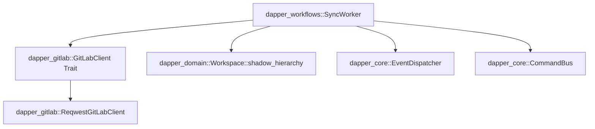

# Phase 3 Architectural Design Document: GitLab Sync Engine, Conflict Resolution & Dry Push

This document details the architectural design and implementation specification for **Phase 3: GitLab Sync Engine, Conflict Resolution & Dry Push** (`crates/dapper_gitlab` and `crates/dapper_workflows`).

---

## 1. Objectives & Scope of Phase 3

1. **`dapper_gitlab` Crate:** Implement asynchronous HTTP client (`reqwest`, `serde`) for GitLab REST & GraphQL endpoints, implementing the `GitLabClient` trait for mockability during TDD.
2. **`GitLabTransformer` Data Engine:** Transform raw GitLab group epics and project issues into domain model hierarchies (`Epic`, `Feature`, `Story`), mapping status labels, legacy statuses, and orphan issue triage.
3. **`dapper_workflows` Crate (`SyncWorker`):** Implement async `SyncWorker` controlling Pull, Push, Member, Label, and Iteration synchronization.
4. **Dry-Push Simulation Engine:** Compare local workspace items against remote items and `shadow_hierarchy` baseline without mutating GitLab. Emit `DryPushCompleted` events with formatted object lists.
5. **Bidirectional Conflict Detection & Resolution:**
   - Detect diverged items where both local and remote changed relative to `shadow_hierarchy` baseline.
   - Support structural reparenting conflict diffs (`parent_epic_id`, `parent_feature_id`).
   - Auto-accept unmodified local items during Pull.
   - Automatically update `shadow_hierarchy` baseline post-push and post-conflict resolution.

---

## 2. Workspace Crate Architecture & Dependencies



### Root `Cargo.toml` (`/Cargo.toml`) Workspace Update
Add `"crates/dapper_gitlab"` and `"crates/dapper_workflows"` to `[workspace.members]`.

### Workspace Dependencies (`[workspace.dependencies]`)
- `reqwest = { version = "0.12", features = ["json"] }`
- `async-trait = "0.1"`

---

## 3. Technical Specifications

### A. Trait-Based GitLab Client Interface (`crates/dapper_gitlab/src/client.rs`)

```rust
use async_trait::async_trait;
use dapper_domain::{Epic, Feature, Iteration, Label, Member, Story};
use crate::errors::GitLabError;

#[async_trait]
pub trait GitLabClientTrait: Send + Sync {
    async fn fetch_members(&self, group_id: i64) -> Result<Vec<Member>, GitLabError>;
    async fn fetch_labels(&self, group_id: i64) -> Result<Vec<Label>, GitLabError>;
    async fn fetch_iterations(&self, group_id: i64) -> Result<Vec<Iteration>, GitLabError>;
    async fn fetch_group_epics(&self, group_id: i64) -> Result<Vec<Epic>, GitLabError>;
    async fn fetch_project_issues(&self, project_id: i64) -> Result<Vec<Story>, GitLabError>;
    async fn push_story(&self, story: &Story) -> Result<Story, GitLabError>;
    async fn push_feature(&self, feature: &Feature) -> Result<Feature, GitLabError>;
    async fn push_epic(&self, epic: &Epic) -> Result<Epic, GitLabError>;
}
```

### B. Shadow Hierarchy Merge Baseline & Diff Detection (`crates/dapper_workflows/src/conflict_engine.rs`)

```rust
use dapper_domain::{Epic, Feature, Story, Workspace};
use serde_json::Value;

pub struct ConflictEngine;

#[derive(Debug, Clone, PartialEq)]
pub struct ItemDiff {
    pub item_id: String,
    pub has_local_changed: bool,
    pub has_remote_changed: bool,
    pub is_conflicted: bool,
    pub field_diffs: Vec<String>,
}

impl ConflictEngine {
    /// Detects conflict for a story by comparing local and remote state against shadow_hierarchy baseline.
    pub fn evaluate_story_diff(
        local: &Story,
        remote: &Story,
        shadow: Option<&Value>,
    ) -> ItemDiff {
        // Field comparison: title, description, weight, status, assignee_id, iteration_id, labels, parent_feature_id
        let local_val = serde_json::to_value(local).unwrap_or_default();
        let remote_val = serde_json::to_value(remote).unwrap_or_default();

        let has_local_changed = match shadow {
            Some(sh) => local_val != *sh,
            None => true,
        };

        let has_remote_changed = match shadow {
            Some(sh) => remote_val != *sh,
            None => true,
        };

        let is_conflicted = has_local_changed && has_remote_changed && (local_val != remote_val);

        ItemDiff {
            item_id: local.id.clone(),
            has_local_changed,
            has_remote_changed,
            is_conflicted,
            field_diffs: vec![],
        }
    }
}
```

### C. SyncWorker Implementation (`crates/dapper_workflows/src/sync_worker.rs`)

```rust
use dapper_core::AppContext;
use dapper_gitlab::GitLabClientTrait;
use std::sync::Arc;
use tracing::instrument;

pub struct SyncWorker {
    app_context: AppContext,
    gitlab_client: Arc<dyn GitLabClientTrait>,
}

impl SyncWorker {
    pub fn new(app_context: AppContext, gitlab_client: Arc<dyn GitLabClientTrait>) -> Self {
        Self {
            app_context,
            gitlab_client,
        }
    }

    #[instrument(skip(self))]
    pub async fn execute_pull(&self, group_id: i64) -> Result<(), anyhow::Error> {
        // 1. Fetch remote epics, issues, members, labels, iterations
        // 2. Compare against local workspace & shadow_hierarchy
        // 3. Auto-accept non-conflicted remote items
        // 4. Mark conflicted items with is_conflicted = true and dispatch ConflictDetected
        Ok(())
    }

    #[instrument(skip(self))]
    pub async fn execute_dry_push(&self) -> Result<(), anyhow::Error> {
        // 1. Scan local modifications vs shadow_hierarchy baseline
        // 2. Format detailed lists of Creations, Updates, Deletions, Conflicts
        // 3. Log via tracing::info!
        // 4. Dispatch Event::DryPushCompleted
        Ok(())
    }

    #[instrument(skip(self))]
    pub async fn execute_push(&self) -> Result<(), anyhow::Error> {
        // 1. Push non-conflicted creations/updates to GitLab API
        // 2. Post-push: Call workspace.save_shadow_hierarchy() to update baseline
        // 3. Dispatch Event::SyncCompleted
        Ok(())
    }
}
```

---

## 4. Pre-Implementation Review Questions for Discussion

> [!IMPORTANT]
> **Phase 3 Review Questions for Discussion:**
> 1. **HTTP Client Crate:** Shall we use `reqwest` with Tokio async runtime for all GitLab REST/GraphQL requests?
> 2. **Structural Reparenting Diffs:** Confirming that reparenting fields (`parent_epic_id` for features, `parent_feature_id` for stories) are evaluated in diff detection to catch remote/local move conflicts.
> 3. **Post-Push Shadow Baseline Update:** Confirming that post-push automatically triggers `workspace.save_shadow_hierarchy()` to prevent false merge conflicts on subsequent sync operations.
