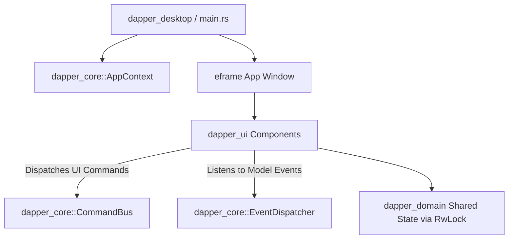

# Phase 4 Architectural Design Document: Native Desktop GUI & Application Binary

This document details the architectural design and implementation specification for **Phase 4: Native Desktop GUI & Application Binary** (`crates/dapper_ui` and `crates/dapper_desktop`).

---

## 1. Objectives & Scope of Phase 4

1. **GUI Framework Integration:** Integrate **`egui` / `eframe`** (immediate mode native Rust GUI) for high-performance rendering.
2. **`dapper_ui` Library Crate:** Implement reusable UI view components, panes, and modal dialogs:
   - **Agile Backlog Pane:** Hierarchical tree view (Epics -> Features -> Stories), filtering, search bar, and story editor pane.
   - **PI Planning Pane:** Team capacity spreadsheet grid, utilization factor controls, and sprint metrics.
   - **Integrations Modal:** Dry-Push summary details pane (creations, updates, conflicts, deletions) and GitLab sync controls.
   - **Conflict Resolution Modal:** Interactive side-by-side diff resolution editor (including structural reparenting).
   - **Settings & Theme Manager:** Light/Dark theme switching and workspace preferences.
3. **`dapper_desktop` Thin Binary Crate:**
   - Implement `main.rs` initializing `AppContext`, `CommandBus`, `EventDispatcher`, and `eframe` window viewport (1920x1080).
   - Integrate `anyhow` top-level error context aggregation.
   - Integrate `human-panic` hook to display diagnostic dialogs on unexpected panics.

---

## 2. Framework Comparison & Trade-Off Analysis

| Feature / Aspect | **`egui` (Selected)** | **`Slint`** | **`iced`** |
| :--- | :--- | :--- | :--- |
| **Paradigm** | Immediate Mode (Pure Rust UI) | Retained Mode (`.slint` DSL) | Retained Mode (Elm Architecture) |
| **DX & Language** | 100% Pure Rust code | Requires learning `.slint` markup | 100% Pure Rust code |
| **Tree Views & Grids** | Built-in `CollapsingHeader`, table grids | Custom item delegates | Custom widget implementation |
| **State Integration** | Reads `Arc<RwLock<Workspace>>` directly | Requires property bindings | Requires message mapping |
| **Cross-Platform** | Native Linux, macOS, Windows | Native Linux, macOS, Windows | Native Linux, macOS, Windows |

---

## 3. Workspace Crate Layout & GUI Architecture



### Root `Cargo.toml` Workspace Updates
Add `"crates/dapper_ui"` and `"crates/dapper_desktop"` to `[workspace.members]`.

### Workspace Dependencies (`[workspace.dependencies]`)
- `egui = "0.29"`
- `eframe = "0.29"`
- `human-panic = "2.0"`

---

## 4. Technical Specifications

### A. `dapper_ui` Component Architecture (`crates/dapper_ui/src/`)

```rust
use dapper_core::AppContext;
use egui::Context;

pub trait ViewComponent {
    fn ui(&mut self, ui: &mut egui::Ui, ctx: &AppContext);
}

pub struct MainWindow {
    app_context: AppContext,
    active_tab: ViewTab,
    backlog_pane: BacklogPane,
    pi_planner_pane: PiPlannerPane,
    settings_dialog: SettingsDialog,
    dry_push_modal: DryPushModal,
    conflict_modal: ConflictResolutionModal,
}

#[derive(Debug, Clone, Copy, PartialEq, Eq)]
pub enum ViewTab {
    Backlog,
    PiPlanner,
    Settings,
    Integrations,
}
```

### B. Thin Binary Crate `dapper_desktop` (`crates/dapper_desktop/src/main.rs`)

```rust
use anyhow::Result;
use dapper_core::{AppContext, CommandBus, EventDispatcher};
use dapper_ui::DapperApp;
use human_panic::setup_panic;
use tracing::info;

fn main() -> Result<()> {
    // 1. Setup panic hook for graceful UI crash reporting
    setup_panic!();

    // 2. Initialize tracing telemetry
    tracing_subscriber::fmt::init();
    info!("Starting DapperPlanning Native Desktop...");

    // 3. Initialize CQRS buses and AppContext
    let (command_bus, _cmd_rx) = CommandBus::default_bus();
    let event_dispatcher = EventDispatcher::default();
    let app_context = AppContext::new(command_bus, event_dispatcher);

    // 4. Configure eframe native window viewport options (1920x1080)
    let native_options = eframe::NativeOptions {
        viewport: egui::ViewportBuilder::default()
            .with_inner_size([1920.0, 1080.0])
            .with_min_inner_size([1024.0, 728.0])
            .with_title("DapperPlanning - Native Rust Desktop"),
        ..Default::default()
    };

    // 5. Launch eframe event loop
    eframe::run_native(
        "DapperPlanning",
        native_options,
        Box::new(|_cc| Ok(Box::new(DapperApp::new(app_context)))),
    ).map_err(|e| anyhow::anyhow!("eframe application error: {}", e))
}
```

---

## 5. Pre-Implementation Review Summary

- **GUI Framework:** Approved **`egui` / `eframe`**.
- **Window Viewport Size:** Configured to **1920x1080** (min 1024x728).
- **Panic Strategy:** Approved **`human-panic`** diagnostic crash dialog hook.
