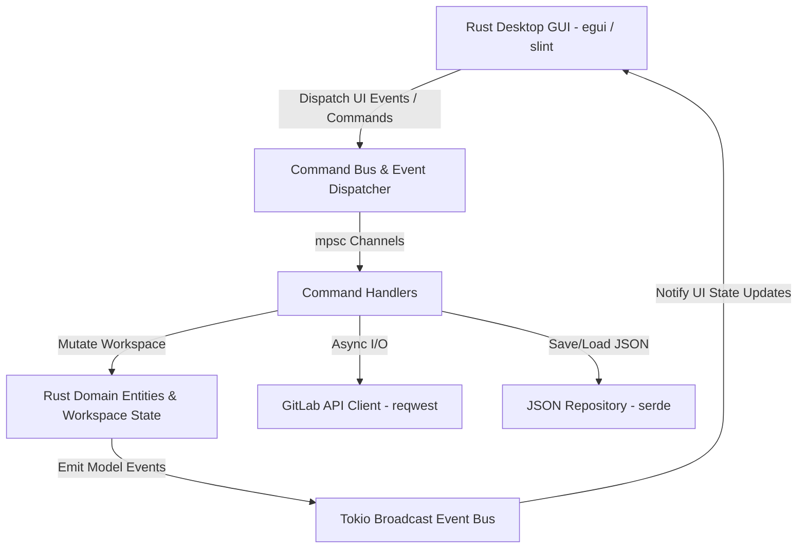

# Master Implementation Plan: Complete Application Migration to Rust

This document is the **Master Implementation Plan** for converting the **entire DapperPlanning application** from **Python 3 / Tkinter** to a high-performance, native **Rust** application.

It is structured into sequential execution phases to ensure zero regression, complete feature parity, and 100% backward compatibility with existing saved `.json` workspaces:

---

## Design & Clarification Protocol (Mandatory Directive)

> [!IMPORTANT]
> **Pre-Implementation Design Review Directive**
> Prior to executing the implementation code for any phase (Phases 1-4), a detailed architectural design document for that specific phase must be presented to and discussed with the user. This ensures all clarifying questions, UI/framework selections, dependency choices, and architectural decisions are resolved as early as possible before any code is written.

---

## Scope & Phase Roadmap

- **Phase 0: Python Golden Baseline Test Suite (COMPLETED)**
  - Implement Golden Workspace JSON schema fixture (`tests/fixtures/golden_workspace.json`).
  - Add PI Planning capacity engine unit tests (`tests/unit/domain/test_capacity_calculator.py`).
  - Add GitLab API transformer pipeline tests (`tests/unit/infrastructure/test_gitlab_transformer.py`).
  - Add Role-Based Permission Matrix unit tests (`tests/unit/domain/test_role_permissions.py`).
  - *Status:* Completed. All 79 Python tests passing.

- **Phase 1: Domain Models, Workspace Engine & JSON Persistence (Rust Core Foundation)**
  - Present Phase 1 design proposal & resolve clarifying questions.
  - Rust crate setup & skeleton initialization (`Cargo.toml`, `src/lib.rs`, `src/main.rs`).
  - Full Rust domain models (`Product`, `Capability`, `Epic`, `Feature`, `Story`, `Team`, `Member`, `Iteration`, `Label`).
  - `Workspace` state machine & `shadow_hierarchy` git-like merge diffing engine.
  - JSON repository persistence (`serde` / `serde_json`) validated against `golden_workspace.json`.
  - Full Rust unit test suite (`cargo test`).

- **Phase 2: CQRS Architecture, Event Bus & App Context**
  - Present Phase 2 design proposal & resolve clarifying questions.
  - Asynchronous `CommandBus` (`tokio::sync::mpsc`).
  - Thread-safe `EventDispatcher` (`tokio::sync::broadcast`).
  - Application Context DI container (`AppContext`).

- **Phase 3: GitLab Sync Engine, Conflict Resolution & Dry Push**
  - Present Phase 3 design proposal & resolve clarifying questions.
  - Async `GitLabClient` (`reqwest`, `tokio`).
  - `SyncWorker` engine for Pull, Push, Member, Label, and Iteration sync.
  - Dry-Push simulation engine with log formatting and markdown report generation.
  - Interactive merge conflict resolution logic (core attributes + structural reparenting).

- **Phase 4: Native Desktop GUI & Feature Panes**
  - Present Phase 4 design proposal & framework selection (slint / egui / iced) with the user.
  - Native cross-platform GUI windowing & layout.
  - Agile Planning tree view, story editor pane, filter dialog, split story dialog.
  - PI Planning capacity engine (spreadsheet grid, team tree, metrics editor).
  - Application settings dialog, theme manager, and standard menu bar.

---

## Proposed Cargo Multi-Crate Workspace Architecture

To ensure strict modular separation, clean dependency boundaries, fast parallel compilation, and maximum reusability, DapperPlanning is modeled as a **Cargo Multi-Crate Workspace** containing dedicated library crates and a thin binary crate.

Separating `dapper_ui` (Library Crate containing UI components, panes, and dialogs) from `dapper_desktop` (Thin Binary Crate containing `src/main.rs`) follows Rust best practices by allowing UI components and view controllers to be directly imported and tested in Cargo integration tests (`tests/*.rs`):

```
dapper_planning/
├── Cargo.toml                       # Workspace Cargo manifest ([workspace] members)
├── RUST_MIGRATION_PLAN.md           # Master migration plan
├── src/                             # Python source directory (PRESERVED INTACT)
├── tests/                           # Python test suite & Golden JSON fixtures (PRESERVED INTACT)
├── crates/
│   ├── dapper_domain/               # Library Crate: Pure Domain Entities & Invariants
│   │   ├── Cargo.toml
│   │   └── src/
│   │       ├── lib.rs
│   │       ├── entities.rs          # Product, Capability, Epic, Feature, Story, Team, Member, Label, Iteration
│   │       ├── workspace.rs         # Workspace state machine & shadow_hierarchy baseline
│   │       ├── capacity.rs          # PI Planning capacity math engine
│   │       └── permissions.rs       # Role-Based Permission Manager & view perspectives
│   │
│   ├── dapper_core/                 # Library Crate: AppContext, CQRS Command Bus, Event Bus
│   │   ├── Cargo.toml
│   │   └── src/
│   │       ├── lib.rs
│   │       ├── app_context.rs       # DI Container (Arc<Mutex<Workspace>>, CommandBus, EventDispatcher)
│   │       ├── command_bus.rs       # Async Command Bus (tokio mpsc channel router)
│   │       ├── commands.rs          # Strongly typed Command enums
│   │       ├── events.rs            # Thread-safe Event Dispatcher (tokio broadcast channel)
│   │       └── constants.rs
│   │
│   ├── dapper_persistence/          # Library Crate: File Persistence, JSON Serialization Repository
│   │   ├── Cargo.toml
│   │   └── src/
│   │       ├── lib.rs
│   │       ├── json_repository.rs   # Serde JSON repository implementation
│   │       └── transformers.rs      # Data transformations & baseline schema migration
│   │
│   ├── dapper_gitlab/               # Library Crate: Asynchronous GitLab API Integration & Sync Engine
│   │   ├── Cargo.toml
│   │   └── src/
│   │       ├── lib.rs
│   │       ├── gitlab_client.rs     # Async reqwest client (epics, issues, members, labels, iterations)
│   │       ├── sync_worker.rs       # Push, Pull, Member, Label, Iteration sync worker
│   │       ├── conflict_resolver.rs # Merge conflict detection logic (core attributes + structural diff)
│   │       └── dry_push.rs          # Dry push simulation & markdown audit report generator
│   │
│   ├── dapper_workflows/            # Library Crate: Feature Workflows & Business Controllers
│   │   ├── Cargo.toml
│   │   └── src/
│   │       ├── lib.rs
│   │       ├── agile_planning.rs    # Agile planning tree & editor state controllers
│   │       ├── pi_planning.rs       # PI Planning capacity spreadsheet & team controllers
│   │       ├── integrations.rs      # Integrations & sync UI controllers
│   │       └── settings.rs          # Settings & Theme controllers
│   │
│   ├── dapper_ui/                   # Library Crate: Desktop GUI Components & Window Layouts
│   │   ├── Cargo.toml
│   │   └── src/
│   │       ├── lib.rs
│   │       ├── main_window.rs       # Main window layout & paned containers
│   │       ├── menu_bar.rs          # Top menu bar actions
│   │       ├── panes/               # Agile tree pane, Editor pane, PI spreadsheet pane
│   │       │   ├── mod.rs
│   │       │   ├── agile_tree_pane.rs
│   │       │   ├── editor_pane.rs
│   │       │   └── pi_spreadsheet_pane.rs
│   │       └── dialogs/             # Conflict modal, Dry Push modal, Settings dialog
│   │           ├── mod.rs
│   │           ├── conflict_modal.rs
│   │           ├── dry_push_modal.rs
│   │           └── settings_dialog.rs
│   │
│   └── dapper_desktop/              # Binary Executable Crate: App Entry Point
│       ├── Cargo.toml
│       └── src/
│           └── main.rs              # Ultra-thin binary entry point (logging init, DI boot, runs dapper_ui)
│
└── tests/                           # Workspace Integration Test Suite
    ├── fixtures/
    │   └── golden_workspace.json     # Baseline JSON schema fixture
    ├── domain_tests.rs
    ├── storage_tests.rs
    ├── cqrs_tests.rs
    └── gitlab_sync_tests.rs
```

---

## Technical Specifications & Safety Directives

> [!IMPORTANT]
> **Preservation of Python Codebase (`src/`) Directive**
> The existing Python codebase (`src/` and `tests/`) **MUST NOT** be deleted or removed during or after the Rust migration. It will remain 100% intact as a reference implementation and baseline test runner. All Rust multi-crate packages will be created inside the dedicated `crates/` directory (`crates/dapper_domain`, `crates/dapper_core`, etc.).

> [!IMPORTANT]
> **Complete Application Scope Notice**
> This master plan converts **100% of the DapperPlanning codebase** from Python to Rust using a multi-crate workspace. Execution begins with **Phase 1 (Rust Core Foundation)** after Phase 1 design approval.

> [!NOTE]
> **Dependencies Strategy**
> - **Async Runtime:** `tokio` for multi-threaded async I/O (GitLab API client, file persistence, background workers).
> - **Serialization:** `serde` + `serde_json` for exact backward-compatible JSON workspace file loading and saving.
> - **HTTP Client:** `reqwest` (with `json` and `rustls-tls` features) for async GitLab API interaction.
> - **GUI Framework:** Native cross-platform UI framework (`egui` or `slint` or `iced`) matching the CQRS event-driven decoupling.
> - **Testing:** Standard Rust `#[cfg(test)]` unit and integration test framework (`cargo test`).

---

## Proposed Architecture & Component Mapping



---

## Component Specifications

### 1. Domain Entities (`src/domain/`)

Rust implementation of the Agile & PI Planning domain models:

```rust
use serde::{Serialize, Deserialize};
use std::collections::HashMap;

#[derive(Debug, Clone, Serialize, Deserialize, PartialEq)]
pub enum Status {
    New,
    InDevelopment,
    InTesting,
    Blocked,
    Complete,
}

#[derive(Debug, Clone, Serialize, Deserialize)]
pub struct Story {
    pub id: String,
    pub title: String,
    pub description: String,
    pub team: Option<Team>,
    pub gitlab_id: Option<i64>,
    pub gitlab_iid: Option<i64>,
    pub weight: f64,
    pub status: Status,
    pub assignee_id: Option<i64>,
    pub iteration_id: Option<i64>,
    pub labels: Vec<String>,
    pub last_synced_at: Option<String>,
    pub is_conflicted: bool,
    pub parent_feature_id: Option<String>,
}

#[derive(Debug, Clone, Serialize, Deserialize)]
pub struct Feature {
    pub id: String,
    pub title: String,
    pub description: String,
    pub team: Option<Team>,
    pub gitlab_id: Option<i64>,
    pub gitlab_iid: Option<i64>,
    pub stories: Vec<Story>,
    pub last_synced_at: Option<String>,
    pub is_conflicted: bool,
    pub parent_epic_id: Option<String>,
}

#[derive(Debug, Clone, Serialize, Deserialize)]
pub struct Epic {
    pub id: String,
    pub title: String,
    pub description: String,
    pub gitlab_id: Option<i64>,
    pub gitlab_iid: Option<i64>,
    pub features: Vec<Feature>,
    pub last_synced_at: Option<String>,
    pub is_conflicted: bool,
}
```

### 2. Workspace & Shadow Hierarchy Baseline

```rust
#[derive(Debug, Clone, Serialize, Deserialize)]
pub struct Workspace {
    pub active_product_name: Option<String>,
    pub products: Vec<Product>,
    pub epics: Vec<Epic>,
    pub members: HashMap<i64, Member>,
    pub labels: HashMap<String, Label>,
    pub iterations: Vec<Iteration>,
    pub shadow_hierarchy: HashMap<String, serde_json::Value>,
    pub deleted_remote_items: Vec<serde_json::Value>,
}

impl Workspace {
    pub fn save_shadow_hierarchy(&mut self) {
        self.shadow_hierarchy.clear();
        for epic in &self.epics {
            if let Ok(val) = serde_json::to_value(epic) {
                self.shadow_hierarchy.insert(epic.id.clone(), val);
            }
            for feature in &epic.features {
                if let Ok(val) = serde_json::to_value(feature) {
                    self.shadow_hierarchy.insert(feature.id.clone(), val);
                }
                for story in &feature.stories {
                    if let Ok(val) = serde_json::to_value(story) {
                        self.shadow_hierarchy.insert(story.id.clone(), val);
                    }
                }
            }
        }
    }
}
```

### 3. Asynchronous CQRS Command Bus & Event Dispatcher

```rust
use tokio::sync::{mpsc, broadcast};

#[derive(Debug, Clone)]
pub enum Command {
    SyncWithGitLab { sync_type: String },
    SaveWorkspace { filepath: String },
    CreateStory { feature_id: String, title: String },
    ResolveConflict { item_id: String, chosen_values: serde_json::Value },
}

#[derive(Debug, Clone)]
pub enum Event {
    HierarchyUpdated,
    ConflictDetected { local_id: String },
    SyncProgress { message: String, percent: u8 },
    DryPushCompleted { creations: usize, updates: usize, conflicts: usize, deletions: usize, report_path: String },
}

pub struct EventDispatcher {
    sender: broadcast::Sender<Event>,
}

impl EventDispatcher {
    pub fn new(capacity: usize) -> Self {
        let (sender, _) = broadcast::channel(capacity);
        Self { sender }
    }

    pub fn dispatch(&self, event: Event) {
        let _ = self.sender.send(event);
    }

    pub fn subscribe(&self) -> broadcast::Receiver<Event> {
        self.sender.subscribe()
    }
}
```

---

## Verification Plan

### Automated Tests
- Run `cargo test` to execute unit, domain, repository serialization, and CQRS channel integration test suites.
- Verify 100% test pass rate for domain logic, shadow hierarchy diffing, and JSON workspace backward compatibility against `golden_workspace.json`.

### Manual Verification
- Verify JSON workspace file export and import compatibility between Python DapperPlanning output JSON files and Rust DapperPlanning.
- Verify bidirectional GitLab API synchronization, conflict resolution modal dialogs, and dry-push simulation outputs.
