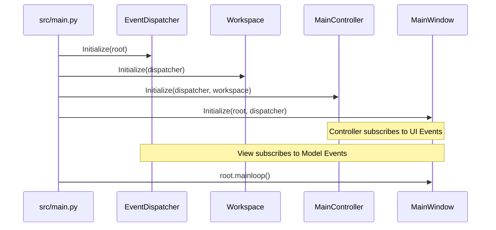
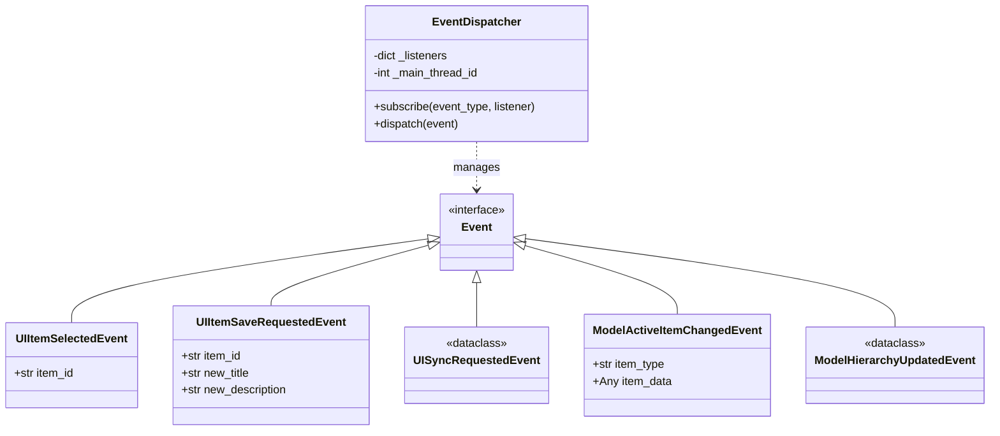

# Main

```mermaid
sequenceDiagram
    participant Main as src/main.py
    participant Disp as EventDispatcher
    participant Model as Workspace
    participant Ctrl as MainController
    participant View as MainWindow

    Main->>Disp: Initialize(root)
    Main->>Model: Initialize(dispatcher)
    Main->>Ctrl: Initialize(dispatcher, workspace)
    Main->>View: Initialize(root, dispatcher)
    
    Note over Ctrl, View: Controller subscribes to UI Events
    Note over View, Disp: View subscribes to Model Events
    
    Main->>View: root.mainloop()
```

# Event Dispatcher

```mermaid
classDiagram
    class Event {
        <<interface>>
    }
    
    class UIItemSelectedEvent {
        +str item_id
    }
    class UIItemSaveRequestedEvent {
        +str item_id
        +str new_title
        +str new_description
    }
    class UISyncRequestedEvent {
        <<dataclass>>
    }
    class ModelActiveItemChangedEvent {
        +str item_type
        +Any item_data
    }
    class ModelHierarchyUpdatedEvent {
        <<dataclass>>
    }

    Event <|-- UIItemSelectedEvent
    Event <|-- UIItemSaveRequestedEvent
    Event <|-- UISyncRequestedEvent
    Event <|-- ModelActiveItemChangedEvent
    Event <|-- ModelHierarchyUpdatedEvent

    class EventDispatcher {
        -dict _listeners
        -int _main_thread_id
        +subscribe(event_type, listener)
        +dispatch(event)
    }

    EventDispatcher ..> Event : manages
```