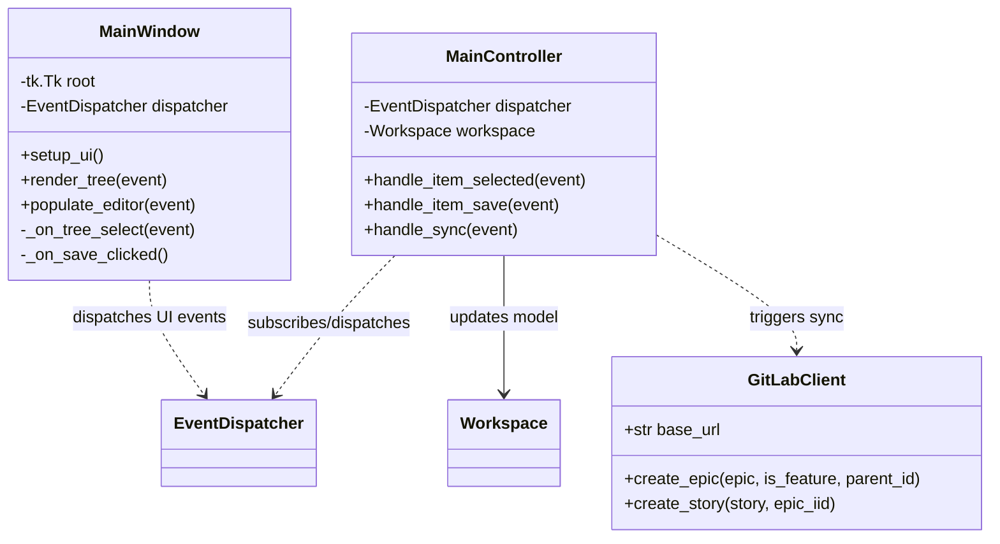
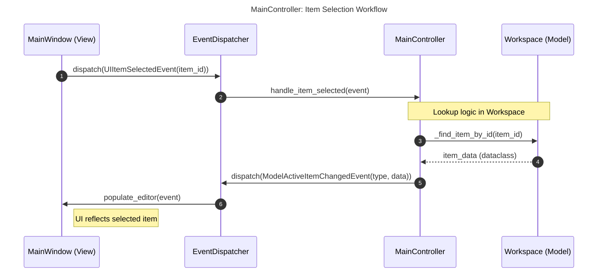
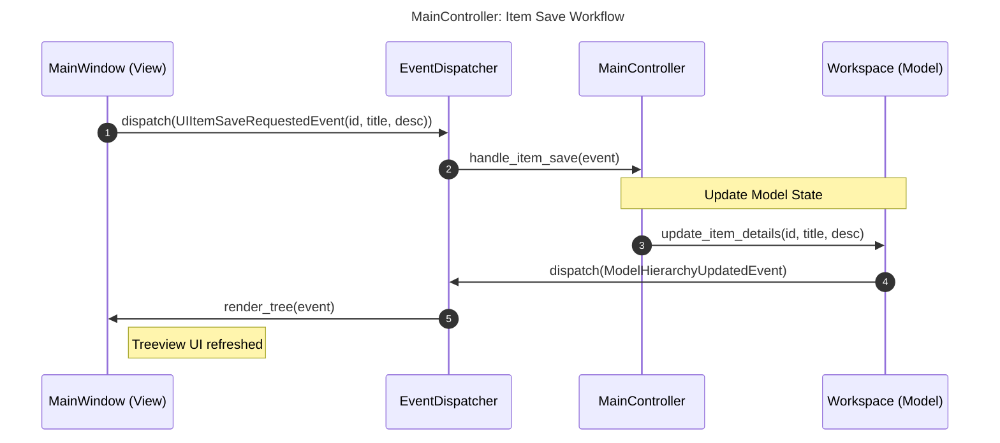

# Main Controller & View
## Class Diagrams

```mermaid
classDiagram
    class MainController {
        -EventDispatcher dispatcher
        -Workspace workspace
        +handle_item_selected(event)
        +handle_item_save(event)
        +handle_sync(event)
    }

    class MainWindow {
        -tk.Tk root
        -EventDispatcher dispatcher
        +setup_ui()
        +render_tree(event)
        +populate_editor(event)
        -_on_tree_select(event)
        -_on_save_clicked()
    }

    class GitLabClient {
        +str base_url
        +create_epic(epic, is_feature, parent_id)
        +create_story(story, epic_iid)
    }

    MainWindow ..> EventDispatcher : dispatches UI events
    MainController ..> EventDispatcher : subscribes/dispatches
    MainController --> Workspace : updates model
    MainController ..> GitLabClient : triggers sync
```

## Sequence Diagrams

```mermaid
sequenceDiagram
    autonumber
    title MainController: Item Selection Workflow
    
    participant V as MainWindow (View)
    participant D as EventDispatcher
    participant C as MainController
    participant M as Workspace (Model)

    V->>D: dispatch(UIItemSelectedEvent(item_id))
    D->>C: handle_item_selected(event)
    
    Note over C, M: Lookup logic in Workspace
    C->>M: _find_item_by_id(item_id)
    M-->>C: item_data (dataclass)

    C->>D: dispatch(ModelActiveItemChangedEvent(type, data))
    D->>V: populate_editor(event)
    Note right of V: UI reflects selected item
```

```mermaid
sequenceDiagram
    autonumber
    title MainController: Item Save Workflow
    
    participant V as MainWindow (View)
    participant D as EventDispatcher
    participant C as MainController
    participant M as Workspace (Model)

    V->>D: dispatch(UIItemSaveRequestedEvent(id, title, desc))
    D->>C: handle_item_save(event)

    Note over C, M: Update Model State
    C->>M: update_item_details(id, title, desc)
    M->>D: dispatch(ModelHierarchyUpdatedEvent)

    D->>V: render_tree(event)
    Note right of V: Treeview UI refreshed
```