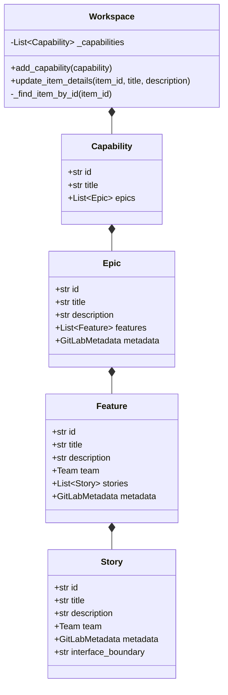

```mermaid
classDiagram
    class Workspace {
        -List~Capability~ _capabilities
        +add_capability(capability)
        +update_item_details(item_id, title, description)
        -_find_item_by_id(item_id)
    }

    class Capability {
        +str id
        +str title
        +List~Epic~ epics
    }

    class Epic {
        +str id
        +str title
        +str description
        +List~Feature~ features
        +GitLabMetadata metadata
    }

    class Feature {
        +str id
        +str title
        +str description
        +Team team
        +List~Story~ stories
        +GitLabMetadata metadata
    }

    class Story {
        +str id
        +str title
        +str description
        +Team team
        +GitLabMetadata metadata
        +str interface_boundary
    }

    Workspace *-- Capability
    Capability *-- Epic
    Epic *-- Feature
    Feature *-- Story
```